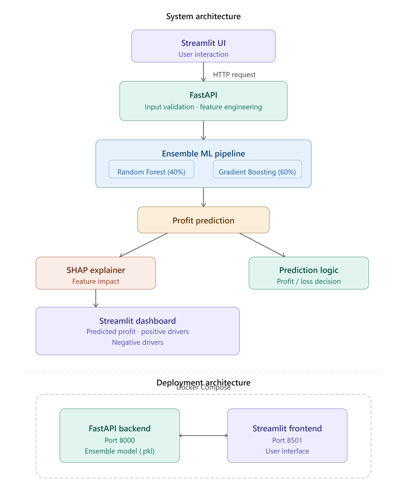

# 🏪 Global Superstore Profit Prediction


## 📌 Project Overview

This project analyzes the Global Superstore dataset and builds an end-to-end Machine Learning solution to predict order-level profit based on sales, discounts, customer segments, product categories, and regional information.

The solution combines Exploratory Data Analysis (EDA), Statistical Hypothesis Testing, Ensemble Machine Learning, Explainable AI (SHAP), FastAPI backend services, and an interactive Streamlit dashboard to generate business insights and profit forecasts.

### 🔄 Prediction Workflow

User → Streamlit → FastAPI → Ensemble ML Model → SHAP Explanation → Result

---

## 🏗️ System Architecture



---

## 🎯 Business Problem

Businesses often struggle to identify factors that drive profitability.

This project aims to:

* Understand sales and profit patterns
* Identify loss-making scenarios
* Measure the impact of discounts on profitability
* Generate business insights through KPI dashboards
* Predict profit for new orders using Machine Learning

---

## 📊 Dataset

**Global Superstore Dataset**

* 51,289 Orders
* 140+ Countries
* Multiple Product Categories
* Sales, Profit, Discount, Shipping Cost
* Customer Segments and Regions

---

## 🔍 Exploratory Data Analysis

Key analyses performed:

* Sales Distribution Analysis
* Profitability Analysis
* Segment-wise Performance
* Category & Sub-Category Analysis
* Regional Performance Analysis
* Discount Impact Analysis
* Shipping Cost Analysis

### Key Insights

✅ Consumer segment contributes the highest sales and profit.

✅ Extreme discounts significantly reduce profitability.

✅ Technology products generally generate higher profits.

✅ High sales do not always guarantee high profit.

---

## 🧪 Statistical Hypothesis Testing

The project validates business assumptions using statistical testing:

| Hypothesis                                   | Test Used            |
| -------------------------------------------- | -------------------- |
| Profit differs across customer segments      | Kruskal-Wallis Test  |
| Technology is more profitable than Furniture | Mann-Whitney U Test  |
| Discount negatively impacts profit           | Spearman Correlation |
| Profit differs across markets                | Kruskal-Wallis Test  |

---

## 🤖 Machine Learning Solution

### Feature Engineering

Engineered features include:

* Log Sales
* Log Shipping Cost
* Discount Buckets
* High Discount Indicator
* Category Flags
* Segment Flags
* Time-Based Features

### Models Trained

* Random Forest Regressor
* Gradient Boosting Regressor
* Weighted Ensemble Model

### Final Model

Weighted Ensemble:

Profit Prediction = 0.4 × Random Forest + 0.6 × Gradient Boosting

---

## 📈 Model Performance

| Metric   | Score |
| -------- | ----- |
| MAE      | 35.51 |
| RMSE     | 83.96 |
| R² Score | 0.77  |

The ensemble model achieved strong predictive performance while maintaining interpretability.

---

## 🔍 Explainable AI with SHAP

To improve model transparency and trustworthiness, SHAP (SHapley Additive Explanations) was integrated into the prediction pipeline.

SHAP explains individual profit predictions by quantifying how each feature contributes to increasing or decreasing the predicted profit.

### Features Explained

* Sales
* Discount
* Discount Amount
* Shipping Cost
* Product Category
* Sub-Category
* Customer Segment
* Region
* Time-Based Features

### Example Interpretation

For a predicted order profit:

* Positive Drivers increase the predicted profit.
* Negative Drivers decrease the predicted profit.
* Each SHAP value represents the contribution of a feature to the final prediction.

Example:

* Discount Amount (+13.28) → increased predicted profit.
* Discount (+11.84) → increased predicted profit.
* Sales (-19.04) → reduced predicted profit.

### Benefits

✅ Transparent model predictions

✅ Business-friendly interpretation of ML outputs

✅ Identification of key profit drivers

✅ Improved stakeholder trust in model recommendations

The Streamlit application provides real-time SHAP explanations alongside each profit prediction, allowing users to understand why a prediction was generated rather than only viewing the final profit estimate.

---

## 🖥️ Streamlit Application

Features:

* Dataset Overview
* EDA & Business Insights
* KPI Dashboard
* Profit Prediction Interface
* Real-Time Profit Forecasting

---

## 📷 Application Screenshots

### KPI Dashboard


### Feature Importance Analysis


### Profit Prediction Interface
ℹ️ Prediction Note

This prediction is generated using key business features including Sales, Discount, Quantity, Shipping Cost, Category, Segment, Region, Sub-Category, and Order Date.

Some advanced operational features available in the original dataset (such as Market, Shipping Days, and Order Priority) are not included in the prediction interface to keep the application simple and user-friendly. Therefore, predicted values should be interpreted as estimates rather than exact business outcomes.


#### Profit Prediction Example


---

## 🛠️ Tech Stack

* Python
* Pandas
* NumPy
* Scikit-Learn
* SHAP
* FastAPI
* Streamlit
* Docker
* Joblib

---

## 📂 Project Structure


global-superstore-profit-prediction/
│
├── backend/
│   ├── main.py
│   ├── schema.py
│   ├── constants.py
│   ├── feature_engineering.py
│   └── models/
│       └── ensemble_pipeline.pkl
│
├── streamlit_app/
│   ├── app.py
│   └── Images/
│
├── notebooks/
│   └── kaggle_training_notebook.ipynb
│
├── Dockerfile
├── docker-compose.yml
├── requirements.txt
├── .gitignore
├── .dockerignore
└── README.md


---

### 🧠 Model Training Environment

The machine learning model was trained and evaluated using Kaggle Notebooks due to hardware limitations on the local machine. The trained ensemble pipeline was then exported and integrated into the FastAPI backend for deployment.

This approach enabled efficient experimentation while maintaining a lightweight local deployment architecture.


## 🚀 Run Locally

### Option 1: Docker (Recommended)

Build and start the application:

```bash
docker compose up --build
```

Access:

* Frontend (Streamlit): http://localhost:8501
* Backend API Docs: http://localhost:8000/docs

---

### Option 2: Manual Setup

Install dependencies:

```bash
pip install -r requirements.txt
```

Start FastAPI Backend:

```bash
uvicorn backend.main:app --reload
```

Start Streamlit Frontend (new terminal):

```bash
streamlit run streamlit_app/app.py
```

Access:

* Frontend (Streamlit): http://localhost:8501
* Backend API Docs: http://localhost:8000/docs


## 📬 Connect With Me

**Akash Kumar Barnwal**

- 📧 Email: barnwalakash60973@gmail.com
- 🔗 [LinkedIn Profile](https://www.linkedin.com/in/akash-kumar-barnwal-31968a380/)
- 💻 [GitHub Profile](https://github.com/barnwalakash60973-pixel)
- 📂 [Project Repository](https://github.com/barnwalakash60973-pixel/global-superstore-profit-prediction)


