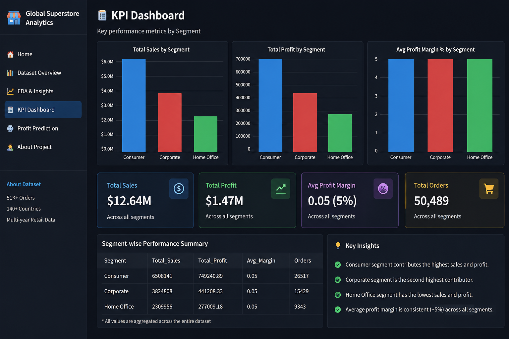
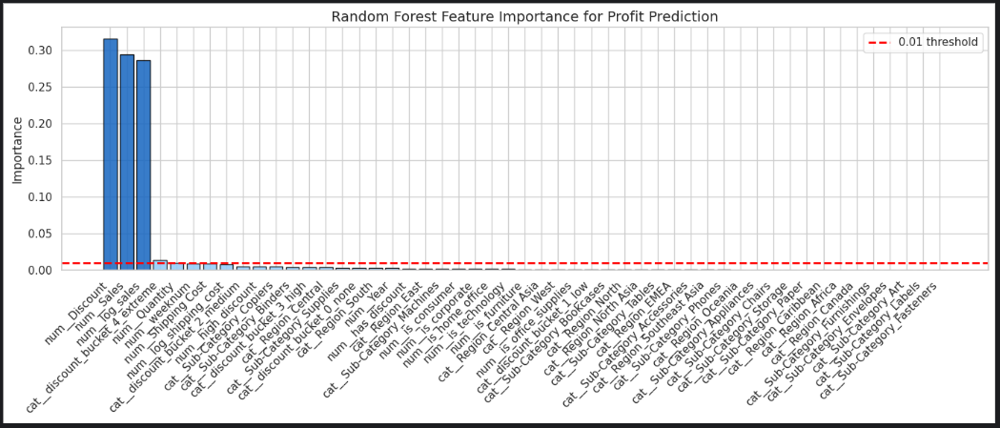
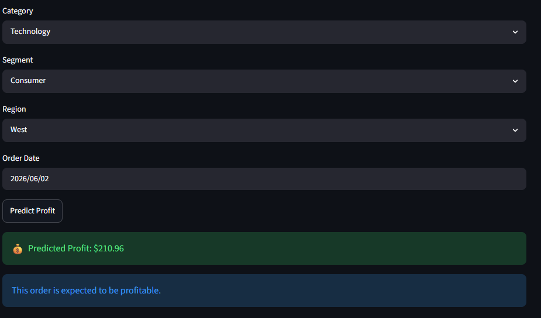

# 🏪 Global Superstore Profit Prediction

## 📌 Project Overview

This project analyzes the Global Superstore dataset and builds a Machine Learning solution to predict order-level profit based on sales, discounts, customer segments, product categories, and regional information.

The project combines Exploratory Data Analysis (EDA), Statistical Hypothesis Testing, Business Intelligence Dashboards, and Ensemble Machine Learning to generate actionable business insights and accurate profit predictions.

---

## 🎯 Business Problem

Businesses often struggle to identify factors that drive profitability.

This project aims to:

* Understand sales and profit patterns
* Identify loss-making scenarios
* Measure the impact of discounts on profitability
* Generate business insights through KPI dashboards
* Predict profit for new orders using Machine Learning

---

## 📊 Dataset

**Global Superstore Dataset**

* 51,289 Orders
* 140+ Countries
* Multiple Product Categories
* Sales, Profit, Discount, Shipping Cost
* Customer Segments and Regions

---

## 🔍 Exploratory Data Analysis

Key analyses performed:

* Sales Distribution Analysis
* Profitability Analysis
* Segment-wise Performance
* Category & Sub-Category Analysis
* Regional Performance Analysis
* Discount Impact Analysis
* Shipping Cost Analysis

### Key Insights

✅ Consumer segment contributes the highest sales and profit.

✅ Extreme discounts significantly reduce profitability.

✅ Technology products generally generate higher profits.

✅ High sales do not always guarantee high profit.

---

## 🧪 Statistical Hypothesis Testing

The project validates business assumptions using statistical testing:

| Hypothesis                                   | Test Used            |
| -------------------------------------------- | -------------------- |
| Profit differs across customer segments      | Kruskal-Wallis Test  |
| Technology is more profitable than Furniture | Mann-Whitney U Test  |
| Discount negatively impacts profit           | Spearman Correlation |
| Profit differs across markets                | Kruskal-Wallis Test  |

---

## 🤖 Machine Learning Solution

### Feature Engineering

Engineered features include:

* Log Sales
* Log Shipping Cost
* Discount Buckets
* High Discount Indicator
* Category Flags
* Segment Flags
* Time-Based Features

### Models Trained

* Random Forest Regressor
* Gradient Boosting Regressor
* Weighted Ensemble Model

### Final Model

Weighted Ensemble:

Profit Prediction = 0.4 × Random Forest + 0.6 × Gradient Boosting

---

## 📈 Model Performance

| Metric   | Score |
| -------- | ----- |
| MAE      | 35.90 |
| RMSE     | 84.96 |
| R² Score | 0.76  |

The ensemble model achieved strong predictive performance while maintaining interpretability.

---

## 🖥️ Streamlit Application

Features:

* Dataset Overview
* EDA & Business Insights
* KPI Dashboard
* Profit Prediction Interface
* Real-Time Profit Forecasting

---

## 📷 Application Screenshots

### KPI Dashboard




### Feature Importance Analysis



### Profit Prediction Interface
ℹ️ Prediction Note

This prediction is generated using key business features including Sales, Discount, Quantity, Shipping Cost, Category, Segment, Region, Sub-Category, and Order Date.

Some advanced operational features available in the original dataset (such as Market, Shipping Days, and Order Priority) are not included in the prediction interface to keep the application simple and user-friendly. Therefore, predicted values should be interpreted as estimates rather than exact business outcomes.


#### Profit Prediction Example



---

## 🛠️ Tech Stack

* Python
* Pandas
* NumPy
* Scikit-Learn
* Streamlit
* Joblib

---

## 📂 Project Structure

global-superstore-profit-prediction/

├── notebooks/

│ └── global_superstore_profit_prediction.ipynb

├── streamlit_app/

│ ├── Images/

│ ├── app.py

│ ├── constants.py                          

│ ├── ensemble_pipeline.pkl

│ └── prediction.py

├──.gitignore                   

├── README.md

└── requirements.txt

---

## 🚀 Run Locally

```bash
pip install -r requirements.txt
python -m streamlit run streamlit_app/app.py
```

---

## 📬 Contact

Akash Kumar

LinkedIn: (Add LinkedIn URL)

GitHub: (Add GitHub URL)
